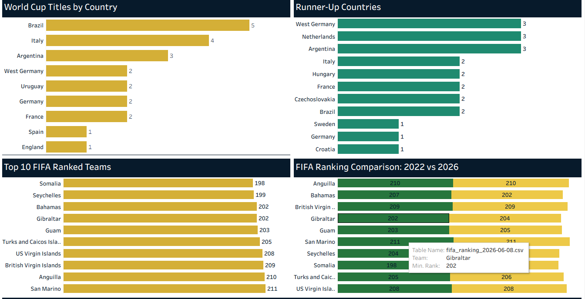
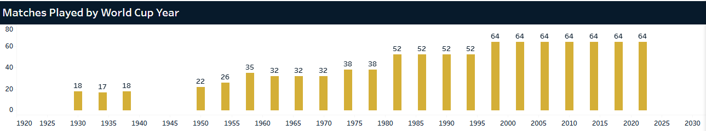

# FIFA World Cup Tableau Dashboard

Interactive FIFA World Cup Data Analysis and Visualization Dashboard created using Tableau.

## Project Overview

This project analyzes FIFA World Cup historical data and FIFA team rankings through interactive Tableau dashboards.

The dashboard presents key insights related to:

- FIFA World Cup history
- World Cup titles by country
- Runner-up countries
- Matches played by World Cup year
- Total goals
- Average goals per match
- World Cup attendance trends
- FIFA ranking analysis
- Top-ranked teams
- FIFA ranking comparison

## Dashboard Preview

### Dashboard 1: FIFA World Cup & Ranking Analysis

### Dashboard 2: FIFA Ranking & Country Analysis

### Dashboard 3: Matches Played by World Cup Year

## Key KPIs

- Total World Cups
- Total Matches
- Total Goals
- Average Goals per Match
- World Cup Attendance
- FIFA Team Rankings

## Analysis Areas

### World Cup History
Analysis of World Cup tournaments, matches, goals, attendance, titles, and runner-up countries.

### FIFA Ranking Analysis
Comparison and visualization of FIFA team rankings to understand team positions and ranking patterns.

### Country Performance
Analysis of countries based on World Cup titles, runner-up positions, matches, and tournament performance.

### Tournament Trends
Year-wise analysis of matches, goals, and attendance to identify historical tournament trends.

## Tools & Technologies

- Tableau
- Data Visualization
- Dashboard Design
- Data Analysis
- Exploratory Data Analysis (EDA)
- KPI Analysis
- FIFA World Cup Data Analysis
- FIFA Ranking Analysis
- Interactive Data Visualization

## Data Coverage

The dashboard focuses on historical FIFA World Cup data through the 2022 tournament, along with FIFA ranking analysis included in the project dataset.

## Project Goals

- Analyze historical FIFA World Cup performance
- Compare countries and teams
- Track tournament-level KPIs
- Visualize FIFA rankings
- Identify trends using interactive dashboards
- Present data-driven insights through Tableau

## Skills Demonstrated

- Tableau Dashboard Development
- Data Cleaning and Preparation
- Data Visualization
- KPI Development
- Ranking Analysis
- Trend Analysis
- Interactive Filters
- Dashboard Layout and Design
- Data Storytelling

## Author

Tania Fazal

Data Science | Data Analysis | Tableau

