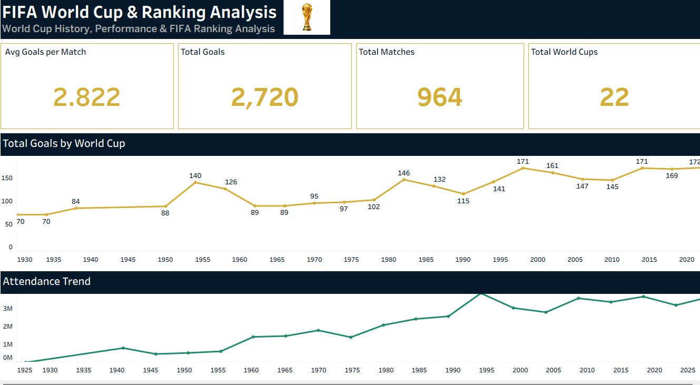

# [FIFA World Cup Analysis 1930-2026](https://public.tableau.com/views/FIFAWORLDCUPANALYSIS_17876546557110/Dashboard1?:language=en-US&:sid=&:redirect=auth&:display_count=n&:origin=viz_share_link)

Interactive FIFA World Cup Data Analysis and Visualization Dashboard created using Tableau.

## Project Overview

This project analyzes FIFA World Cup historical data and FIFA team rankings through interactive Tableau dashboards.

The dashboard presents key insights related to:

- FIFA World Cup history
- World Cup titles by country
- Runner-up countries
- Matches played by World Cup year
- Total goals
- Average goals per match
- World Cup attendance trends
- FIFA ranking analysis
- Top-ranked teams
- FIFA ranking comparison

## Key KPIs

- Total World Cups
- Total Matches
- Total Goals
- Average Goals per Match
- World Cup Attendance
- FIFA Team Rankings

## Data Source
[click here](https://www.kaggle.com/datasets/piterfm/fifa-football-world-cup)

### Author

Tania Fazal

Data Science | Data Analysis | Tableau

